# LLM Bias Traffic Light — Browser Extension User Manual

**Version 1.1.0**

---

## Table of Contents

1. [Introduction](#1-introduction)
2. [Requirements](#2-requirements)
3. [Installation](#3-installation)
4. [Getting Started](#4-getting-started)
5. [Interface Overview](#5-interface-overview)
6. [Core Features](#6-core-features)
   - [6.1 Automatic Scanning of New AI Replies](#61-automatic-scanning-of-new-ai-replies)
   - [6.2 Manually Scanning the Current Page](#62-manually-scanning-the-current-page)
   - [6.3 Scanning a Specific Past Conversation Turn](#63-scanning-a-specific-past-conversation-turn)
   - [6.4 Understanding Your Results](#64-understanding-your-results)
   - [6.5 On-Page Overlay](#65-on-page-overlay)
7. [Settings](#7-settings)
   - [7.1 On-Page Overlays](#71-on-page-overlays)
   - [7.2 Depth](#72-depth)
   - [7.3 Bias Types (BBQ Categories)](#73-bias-types-bbq-categories)
8. [Supported Platforms](#8-supported-platforms)
9. [Troubleshooting](#9-troubleshooting)
10. [Frequently Asked Questions](#10-frequently-asked-questions)

- [Appendix: Glossary](#appendix-glossary)

---

## 1. Introduction

**Bias Detector** is a browser extension that analyzes text from AI chat conversations and flags potential social bias, such as stereotyping related to gender, nationality, religion, age, disability, and other protected categories. It is designed to be used while you chat with AI assistants like ChatGPT, Gemini, Claude, or DeepSeek.

The extension can work in two ways:

- **Automatically:** it watches supported AI chat pages and analyzes each new AI reply as soon as it appears.
- **Manually:** you can scan the whole page, or a specific past turn in the conversation on demand.

Results are shown in the extension popup and, optionally, as floating boxes directly on the page you are viewing.

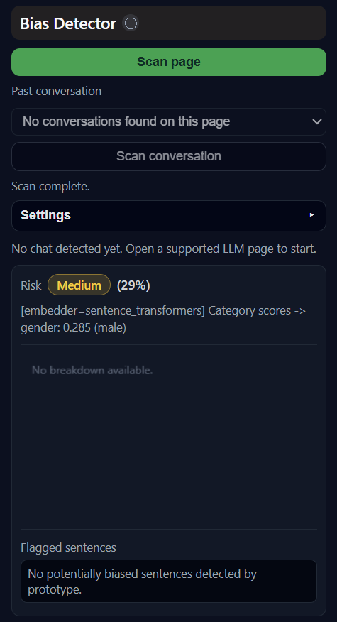 
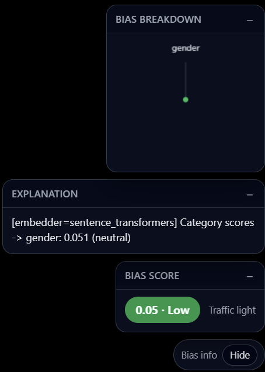 

## 2. Requirements

- A Chromium-based browser (Google Chrome, Microsoft Edge, Brave, etc.) that supports Manifest V3 extensions.
- The Bias Detector backend/API server running locally and reachable at `http://127.0.0.1:8000` (the extension calls the `/analyze` endpoint on this address).
- An active internet connection and an open tab on one of the supported AI chat platforms (see [Section 8](#8-supported-platforms)).

> **Note:** If the backend server is not running, scans will fail with a connection error. Make sure to start it before using the extension.

---

## 3. Installation

LLM Bias Traffic Light is currently distributed as an unpacked extension, intended for development and testing use. To install it:

1. Open your browser and navigate to the extensions page (`chrome://extensions`).
2. Enable **Developer mode** using the toggle, usually located in the top-right corner.
3. Click **Load unpacked**.
4. Select the folder that contains the extension's files (the `-frontend-` folder — the one with `manifest.json`).
5. The Bias Detector icon should now appear in your extensions list and toolbar.

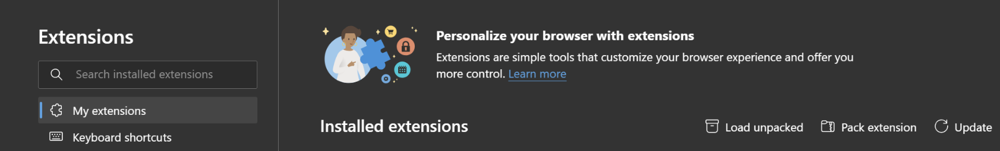

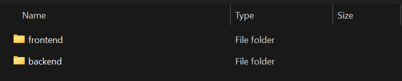

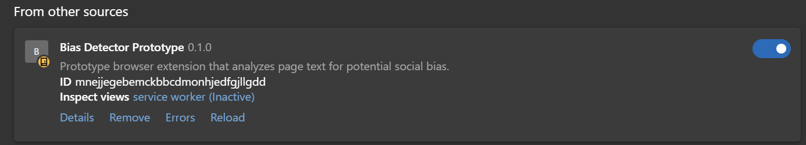

---

## 4. Getting Started

1. Pin the Bias Detector icon to your toolbar for easy access (click the puzzle-piece icon, then the pin icon next to Bias Detector).
2. Open a supported AI chat website (ChatGPT, Gemini, Claude.ai, or DeepSeek).
3. Click the Bias Detector icon to open the popup.
4. If the site is supported, the popup will activate; if not, a warning message will be shown and the controls will be disabled.

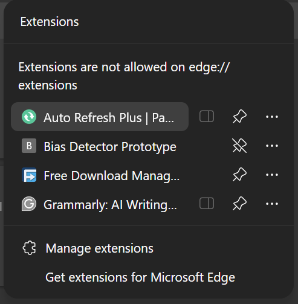

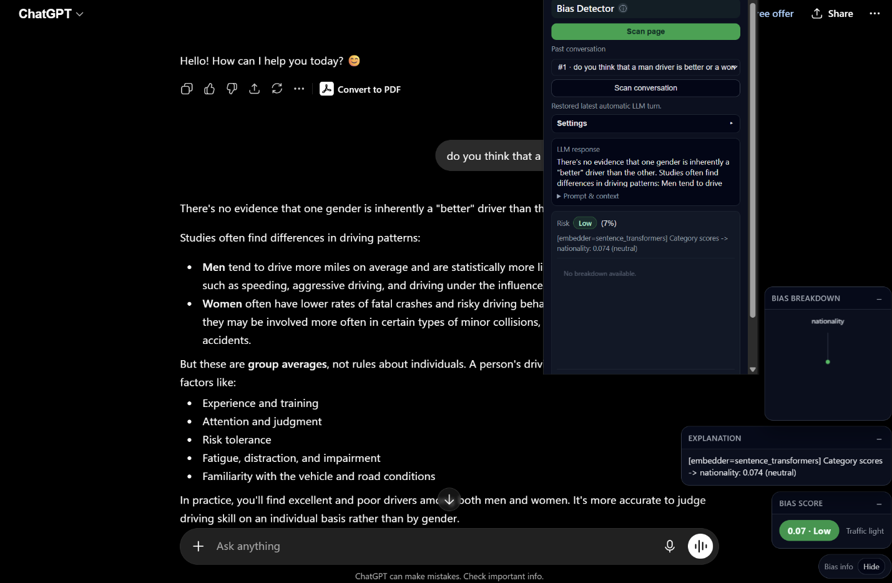

---

## 5. Interface Overview

The popup window is divided into the following areas:

| Area                         | Description                                                                                                                                        |
| ---------------------------- | -------------------------------------------------------------------------------------------------------------------------------------------------- |
| **Header**                   | Shows the extension name and a colored background that reflects the risk level of the most recent scan (green = low, yellow = medium, red = high). |
| **Scan page button**         | Runs a manual scan of the entire current page.                                                                                                     |
| **Past conversation picker** | Appears on supported AI sites; lets you pick and scan a specific previous question/answer turn.                                                    |
| **Status line**              | Shows progress and error messages.                                                                                                                 |
| **Settings panel**           | Collapsible; contains on-page overlay toggles, scan depth, and bias type selection.                                                                |
| **LLM response card**        | Displays the most recently detected prompt, context, and answer.                                                                                   |
| **Result card**              | Shows the risk badge and score, a written explanation, a radar chart of bias-type scores, and a list of flagged sentences.                         |

---

## 6. Core Features

### 6.1 Automatic Scanning of New AI Replies

On supported AI chat sites, the extension watches the page for new assistant messages. When a new reply appears, it is automatically sent to the backend for analysis, and the result is pushed both to the popup (next time it is opened) and to the on-page overlay (if enabled).

- You do not need to click anything for this to happen — simply chat normally with the AI.
- Open the popup at any time to see the most recent automatic result; it is restored even if you closed and reopened the popup.

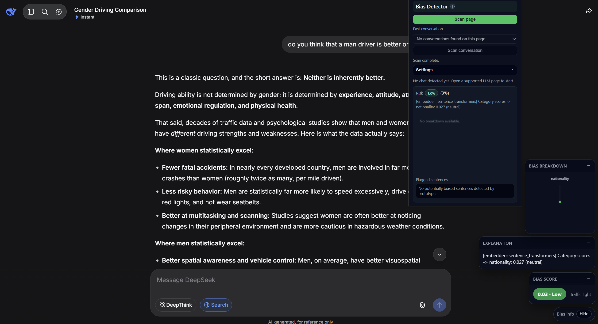

---

### 6.2 Manually Scanning the Current Page

Click **Scan page** to collect all readable text from the active tab and send it to the backend for analysis. This is useful for pages that are not automatically monitored, or to re-analyze the page on demand.

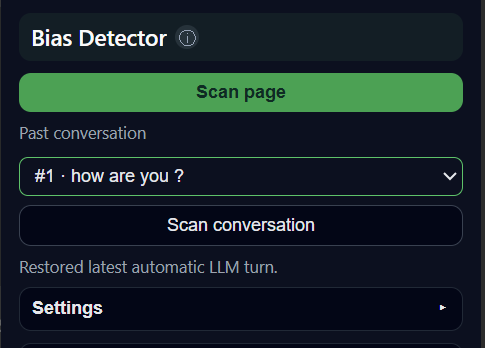

---

### 6.3 Scanning a Specific Past Conversation Turn

On supported AI chat sites, the **Past conversation** dropdown lists the question/answer turns detected on the page. Select a turn to preview its prompt, context, and answer in the LLM response card, then click **Scan conversation** to analyze that specific exchange.

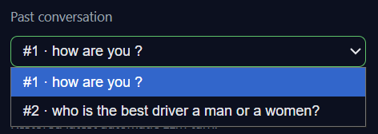

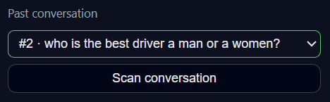

---

### 6.4 Understanding Your Results

After any scan, the Result card shows:

- **Risk badge and score:** a qualitative label (Low / Medium / High) plus the underlying score as a percentage. Low is below 25%, Medium is 25–55%, High is above 55%.
- **Explanation:** a written summary describing why the text was scored the way it was, plus similarity metrics between the question, context, and answer where available.
- **Radar chart:** a breakdown of the bias score across each selected bias type (e.g., gender, age, religion), so you can see which categories contributed most.
- **Flagged sentences:** a list of the specific sentences the backend identified as potentially biased. These sentences are also highlighted directly on the page.

---

### 6.5 On-Page Overlay

In addition to the popup, Bias Detector can display a floating set of info boxes in the bottom-right corner of the page you are browsing. Each box (module) shows one piece of information: bias score, explanation, flagged sentences, or the bias-type radar chart.

- Each box can be collapsed individually using the **−** / **+** button in its header.
- The whole overlay can be hidden with the **Hide** button on its toolbar; a small **Show bias info** button then appears so you can bring it back.
- Which modules appear is controlled from the Settings panel in the popup (see [Section 7.1](#71-on-page-overlays)).

---

## 7. Settings

Open the **Settings** accordion in the popup to access the following options. Your choices are saved automatically and remembered for next time.

### 7.1 On-Page Overlays

- **On-page overlays:** master switch that turns the floating on-page boxes on or off.
- **Score / Explanation / Flagged / Chart:** individually show or hide each overlay module.

### 7.2 Depth

Choose between **Normal** and **Deep** analysis depth. Deep analysis may take longer but can provide a more thorough assessment, depending on how the backend is configured.

### 7.3 Bias Types (BBQ Categories)

Select one or more bias categories to check for, based on the BBQ (Bias Benchmark for QA) categories. You can select multiple categories at once; the radar chart will show one axis per selected category.

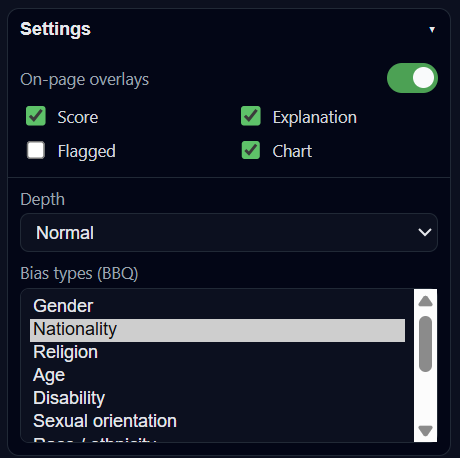

Available categories:

| Category                       | Description                                                              |
| ------------------------------ | ------------------------------------------------------------------------ |
| **Gender**                     | Stereotypes or assumptions based on gender identity.                     |
| **Nationality**                | Bias related to a person's country of origin or nationality.             |
| **Religion**                   | Bias related to religious affiliation or beliefs.                        |
| **Age**                        | Stereotypes based on a person's age group (e.g., "young" vs. "elderly"). |
| **Disability**                 | Bias related to physical, sensory, or cognitive disability.              |
| **Sexual orientation**         | Bias related to sexual orientation.                                      |
| **Race / ethnicity**           | Bias related to race or ethnic background.                               |
| **Race × gender**              | Intersectional bias combining race and gender.                           |
| **Race × SES**                 | Intersectional bias combining race and socioeconomic status.             |
| **Socioeconomic status (SES)** | Bias related to income, occupation, or social class.                     |
| **Physical appearance**        | Bias related to physical appearance or body type.                        |

---

## 8. Supported Platforms

Automatic detection, the conversation picker, and on-page highlighting are currently available on:

| Platform     | URL(s)                               |
| ------------ | ------------------------------------ |
| **ChatGPT**  | `chat.openai.com`, `chatgpt.com`     |
| **Gemini**   | `gemini.google.com`, `ai.google.com` |
| **Claude**   | `claude.ai`                          |
| **DeepSeek** | `chat.deepseek.com`, `deepseek.com`  |

On any other website, the popup will show a warning and only basic functionality (if any) will be available.

---

## 9. Troubleshooting

### "Could not connect to page script. Refresh the LLM tab once, then retry."

This usually means the content script has not been injected into the current tab yet, often because the tab was open before the extension was installed or reloaded. Refresh the AI chat tab once, then try again.

### "Could not load conversations" or empty turn picker

The page structure of the AI chat site may have changed, or no messages have been exchanged yet. Try sending a message first, or refreshing the page.

### Scan fails with a network or HTTP error

Confirm that the backend API server is running and reachable at `http://127.0.0.1:8000`. Check your firewall settings if the connection is refused.

### Extension controls are disabled

This happens automatically on websites that are not in the supported list ([Section 8](#8-supported-platforms)). Switch to a supported AI chat site and reopen the popup.

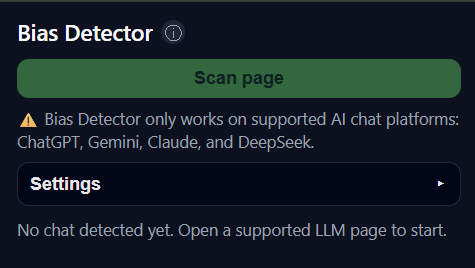

---

## 10. Frequently Asked Questions

### Does the extension send my data anywhere besides the local backend?

No. Your data privacy is a core priority. The extension only communicates with your locally hosted backend server (e.g., localhost) to process text and calculate scores. No text, prompts, or browsing data are ever uploaded to third-party cloud servers or external networks.

### Can I use Bias Detector on AI platforms that are not in the supported list?

No. The extension's core features, including automatic detection, the conversation picker, sentence highlighting, and the Scan page button are only available on the officially supported platforms listed in Section 8 (ChatGPT, Gemini, Claude, and DeepSeek).

### How is the risk score calculated?

The risk score is determined by analyzing the frequency, intensity, and context of biased language within the processed text.

•	Standard Mode: Uses optimized local models to scan the text for explicit keywords, loaded language, and known partisan framing, generating a baseline risk percentage based on density.

•	Deep Mode: Enables an advanced, multi-layered context evaluation. Instead of just counting keywords, it analyzes sentence structure, subtle logical fallacies, and underlying semantic intent. While Deep mode requires more processing power and time, it drastically reduces false positives and uncovers hidden or implicit biases that Standard mode might miss.

### Can I select more than one bias type at a time?

Yes. Select multiple categories in the Settings panel; results and the radar chart will reflect all selected categories.

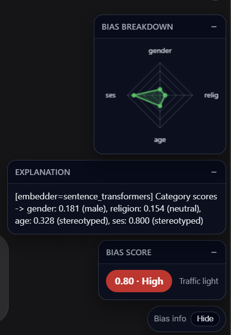

---

## Appendix: Glossary

| Term                  | Definition                                                                                                            |
| --------------------- | --------------------------------------------------------------------------------------------------------------------- |
| **Bias score**        | A number between 0 and 1 (shown as a percentage) representing how likely the analyzed text is to contain social bias. |
| **Risk level**        | A qualitative label derived from the bias score — Low (<25%), Medium (25–55%), High (>55%).                           |
| **Flagged sentences** | Individual sentences the backend determined were most likely to contain biased language.                              |
| **BBQ**               | Bias Benchmark for QA — the category framework used to classify the type of bias being checked for.                   |
| **Turn**              | A single question/answer exchange detected in an AI chat conversation.                                                |

---

_LLM Bias Traffic Light — User Manual v1.1.0_
